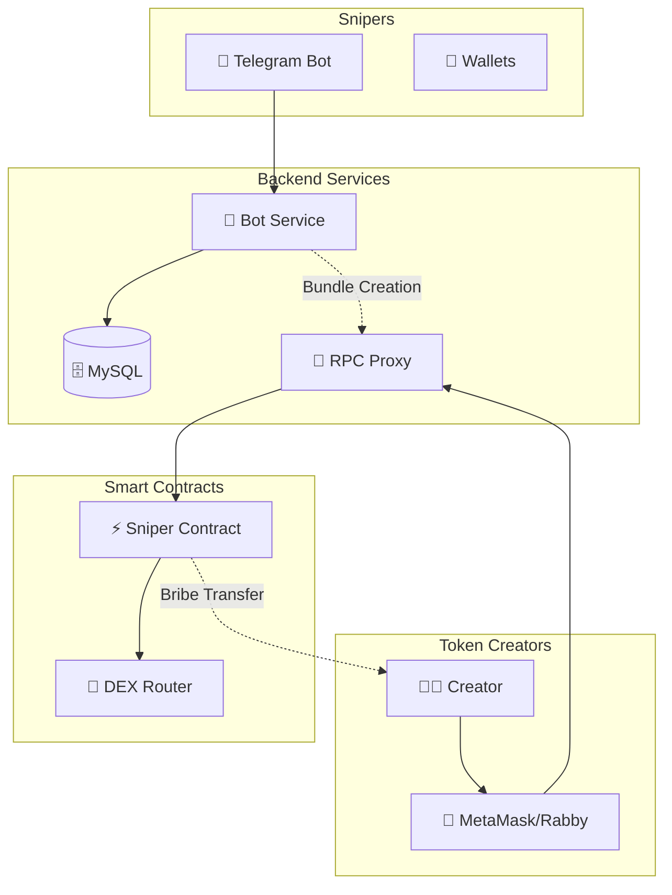
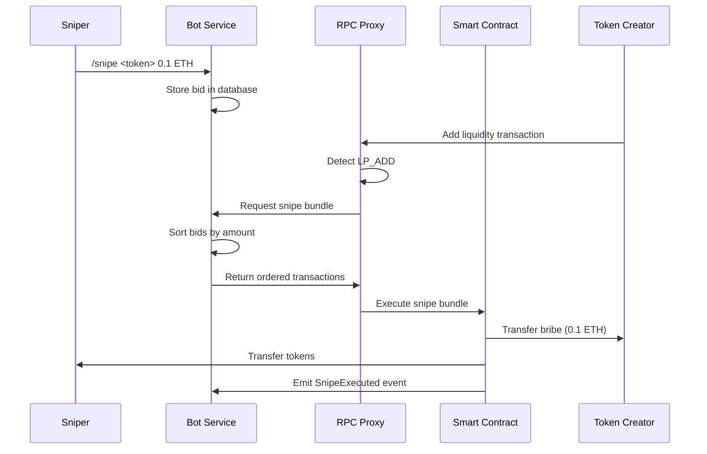

# 🎯 Sniper Bot System

A comprehensive MEV solution that transforms token sniping from creator exploitation into a profitable auction system. Token creators can now monetize sniping activity through competitive bidding, while snipers compete transparently for early access.

## 📋 Project Overview

Instead of losing value to front-running bots, this system enables:

- **📈 Monetized Sniping**: Token creators receive direct bribes from competing snipers
- **🏆 Fair Competition**: Transparent bidding system with highest bribes winning
- **⚡ Atomic Execution**: Smart contracts ensure bribes are paid before snipes execute
- **🔒 Secure Infrastructure**: End-to-end security from wallet generation to transaction execution

## 🏗️ System Architecture



## 🗂️ Project Structure

### [`/backend`](./backend/) - Go Backend Services

**Tech Stack**: Go, MySQL, Telegram Bot API, Ethereum JSON-RPC

- **🤖 Telegram Bot**: User registration, wallet management, bid submission
- **🔗 RPC Proxy**: Transaction interception and bundle construction  
- **💾 Database**: Secure wallet storage and bid management
- **📦 Bundle Manager**: MEV transaction ordering and submission

[📖 Backend Documentation →](./backend/README.md)

### [`/contracts`](./contracts/) - Smart Contracts

**Tech Stack**: Solidity, Foundry, Uniswap V2

- **⚡ Sniper Contract**: Atomic snipe execution with bribe transfers
- **🧪 Test Suite**: Comprehensive contract testing
- **🚀 Deployment Scripts**: Automated deployment tools

[📖 Contracts Documentation →](./contracts/README.md)

## 🚀 Quick Start

### Prerequisites

- **Go** 1.21+
- **Foundry** (latest)
- **MySQL** 8.0+
- **Telegram Bot Token**
- **Base Network RPC**

### 🛠️ Setup Instructions

1. **Clone Repository**:
```bash
git clone <repository-url>
cd sniper-bot
```

2. **Backend Setup**:
```bash
cd backend
cp .env.example .env
# Edit .env with your configuration
make setup
```

3. **Contracts Setup**:
```bash
cd contracts
forge install
forge build
```

4. **Database Setup**:
```bash
# Start MySQL container
docker run --name sniper-mysql \
  -e MYSQL_ROOT_PASSWORD=root_password \
  -e MYSQL_DATABASE=sniper_bot \
  -p 3306:3306 -d mysql:8.0

# Initialize database
cd backend && make db-migrate
```

5. **Deploy Contracts**:
```bash
cd contracts
forge script script/Sniper.s.sol:SniperScript \
  --rpc-url $BASE_RPC_URL \
  --private-key $PRIVATE_KEY \
  --broadcast
```

6. **Start Services**:
```bash
cd backend
make dev  # Starts both bot and RPC services
```

### 🐳 Docker Deployment

```bash
# Production deployment
docker-compose up -d

# View logs
docker-compose logs -f
```

## 💡 How It Works

### For Snipers

1. **Register** via Telegram bot (`/register`)
2. **Submit bids** for upcoming tokens (`/snipe <token> <bribe>`)
3. **Win** based on highest bribe when LP is added
4. **Profit** from early token access

### For Token Creators

1. **Configure** MetaMask to use custom RPC endpoint
2. **Deploy** token contract normally
3. **Add liquidity** through standard DEX interface
4. **Receive** automatic bribe payments from successful snipers

### System Process



## 📊 Key Features

### 🔐 Security Features

- **Encrypted Wallet Storage**: AES-256-GCM encryption for private keys
- **Atomic Transactions**: Smart contracts ensure bribe payment before token transfer
- **Access Control**: User isolation and permission management
- **Input Validation**: Comprehensive validation across all interfaces

### ⚡ Performance Features

- **Connection Pooling**: Efficient database connection management
- **Indexed Queries**: Optimized database performance
- **Parallel Processing**: Concurrent bid processing and bundle construction
- **Gas Optimization**: Efficient smart contract design

### 🛡️ Economic Security

- **Slippage Protection**: Minimum output validation in smart contracts
- **Gas Price Ordering**: Proper transaction ordering in bundles
- **Deadline Enforcement**: Time-limited transaction execution
- **Emergency Controls**: Owner-only recovery mechanisms

## 🔧 Configuration

### Environment Variables

| Component | Variables | Description |
|-----------|-----------|-------------|
| **Backend** | `TELEGRAM_BOT_TOKEN` | Bot authentication |
| | `BASE_RPC_URL` | Base network endpoint |
| | `DATABASE_URL` | MySQL connection |
| | `ADMIN_PRIVATE_KEY` | Admin wallet key |
| **Contracts** | `PRIVATE_KEY` | Deployment key |
| | `UNISWAP_V2_ROUTER` | DEX router address |

## 📈 Monitoring

### Health Checks

```bash
# Backend services
curl http://localhost:8080/health  # Bot service
curl http://localhost:8545/health  # RPC service

# Database connectivity
cd backend && make test-mysql
```

### Key Metrics

- **Snipe Success Rate**: Percentage of successful executions
- **Bundle Construction Time**: Time to build transaction bundles  
- **Database Performance**: Query execution times
- **Gas Usage**: Contract execution costs

## 🧪 Testing

### Backend Tests

```bash
cd backend
make test              # Run all tests
make test-coverage     # With coverage report
```

### Contract Tests

```bash
cd contracts
forge test             # Run all tests
forge test --gas-report  # With gas analysis
```

## 🤝 Contributing

1. **Fork** the repository
2. **Create** feature branch: `git checkout -b feature/amazing-feature`
3. **Implement** changes with tests
4. **Test** thoroughly: `make test` (backend) + `forge test` (contracts)
5. **Submit** pull request

### Development Guidelines

- **Comprehensive Testing**: Maintain high test coverage
- **Security First**: Follow smart contract security best practices
- **Documentation**: Update docs for any interface changes  
- **Gas Optimization**: Profile and optimize contract gas usage

## 🎯 Use Cases

### DeFi Protocol Launches

- **Token Creators**: Maximize launch revenue through sniper bribes
- **Snipers**: Compete fairly for early access with transparent bidding
- **Community**: Reduced MEV extraction creates more equitable launches

### MEV Infrastructure

- **Searchers**: Access structured MEV opportunities  
- **Builders**: Integrate auction mechanisms into block building
- **Validators**: Capture value from structured MEV flows

## 📄 License

This project is licensed under the MIT License - see the [LICENSE](LICENSE) file for details.

## ⚠️ Legal Disclaimer

This software is provided for educational and research purposes only. Users are solely responsible for compliance with applicable laws and regulations. The authors disclaim all liability for any financial losses, legal issues, or other damages arising from the use of this software.

## 🆘 Support & Community

- **🐛 Issues**: [GitHub Issues](https://github.com/your-repo/issues)
- **📚 Documentation**: Check component-specific READMEs
- **💬 Community**: Join our Discord server
- **🔒 Security Issues**: Report privately to `security@example.com`

---

## 🗂️ Repository Structure

```
sniper-bot/
├── 📁 backend/           # Go backend services
│   ├── 📁 pkg/          # Core packages
│   ├── 📁 services/     # Service implementations  
│   ├── 📁 scripts/      # Setup and utility scripts
│   ├── 📄 README.md     # Backend documentation
│   └── 📄 ARCHITECTURE.md
├── 📁 contracts/        # Smart contracts
│   ├── 📁 src/         # Solidity source code
│   ├── 📁 script/      # Deployment scripts
│   ├── 📁 test/        # Contract tests
│   └── 📄 README.md    # Contracts documentation
├── 📄 README.md        # This file
├── 📄 docker-compose.yml
└── 📄 LICENSE
```

---

*🚀 Built with ❤️ for the DeFi community - Transforming MEV from exploitation to fair competition* 